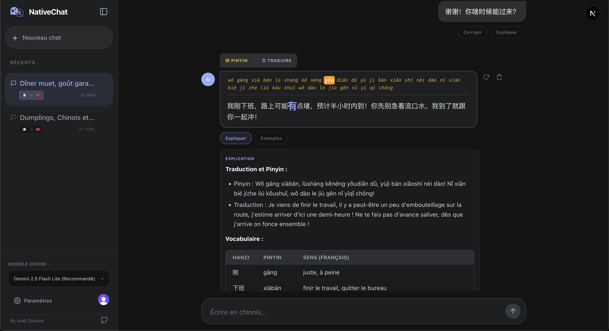

<div align="center">
  
      
  *[Axel Delaval](https://axeldlv00.github.io/axel-delaval-personal-page/) • 27 Février 2026*

  [](https://github.com/AxelDlv00/NativeChat)
[](./LICENSE) 
[](https://native-chat-ai.vercel.app/)

**Other projects in the same ecosystem:**

[](https://github.com/AxelDlv00/ChineseIsEasy)
[](https://github.com/AxelDlv00/GeoChina)
[](https://github.com/AxelDlv00/ChineseIsEasy-Calligraphy)

</div>

# NativeChat 

The initial intent of this project was to help me practice Chinese. Indeed, it is not possible to learn without practice, and the gap before speaking with native speakers is often very large. But, since there is no reason to keep it for myself, I made it available to everyone.

NativeChat is an intelligent messaging application, designed to talk with AI. The cost is very low because it uses small language models (e.g. Gemini 2.5 Flash Lite). The interface looks exactly like a chatbot, but the prompts are designed to make it feel like a real conversation with a native speaker, with tools such as translation, correction, and response suggestions to help you gain from the conversation.

<div align="center">
  
</div>

## Key features

- **Choose the AI model you want to talk to**: Gemini 2.0/2.5 Flash-Lite or GPT-4o/mini.
- **Choose your language and the language you want to practice**: So far, the interface is only in French, but you can learn Chinese, Spanish, Korean, Japanese, German, Italian. If you which to practicer another language you can easily add it in the code if you want to run the instance on your own, otherwise you can ask me to add it.
- **Immersion through Roleplay**: The AI generates random scenarios (bank, restaurant, neighbor, etc.) to break the ice and make the conversation more natural. You can also improve your own scenario by giving a simple idea and letting the AI transform it into a detailed roleplay scenario.
- **Integrated Educational Tools**: Intelligent correction, on-demand explanations, contextual response suggestions, and instant Pinyin/translation toggles to enhance your learning experience.
- **Multi-platform**: Optimized for Web and ready for mobile via Capacitor (Android). Real-time cloud sync with Supabase and secure authentication through Clerk. The database is synchronized in real-time via Supabase and secured by Clerk.

> **Note**: Your api keys are stored locally in your browser and are never sent to the server. However, I do have access to the conversations you have if you use the Vercel deployment. I do not intent to use them nor to read them, but be aware of this. Moreover, I do not guarantee any security of the data, I do not take responsibility for any leak of data. The application is in development, the Vercel deployment is mostly for demonstration purposes, I use the free plan of both Vercel and Supabase. There might be a lot of bugs, and I do not guarantee that the application will work perfectly.

> **Warning**: The AI models are not reliable, they can make mistakes, they can generate inappropriate content. I do not take responsibility for any content generated by the AI models.

## How to use ? 

### Use the existing deployment

**From your browser:**
- Go to [https://native-chat-ai.vercel.app/](https://native-chat-ai.vercel.app/)
- Create an account and log in.
- Go to the settings and add your OpenAI or Gemini API key (you can use the free tier of both providers, but be aware of the limitations). The cost is very low anyway because the application uses small models (e.g. Gemini 2.5 Flash Lite).
- Start a new conversation and enjoy !

**From an android device:**
- You can install the android application from [The apk release](https://github.com/AxelDlv00/NativeChat/releases). 
- NativeChat is optimized to run on browsers, so the experience on the mobile application might not be perfect. For instance, when sign-in, you might be redirected to the browser. But depsite these small inconveniences, it is still very useful, and very lightweight.

### Use your own instance

- Go to [Supabase](https://supabase.com/) and create a new project. Note the URL and the anon key.
- Go to [Clerk](https://clerk.com/) and create a new application. Note the publishable key and the secret key. 
- In the NativeChat project root, create a `.env` file containing : 

```env
# Supabase PostgreSQL
NEXT_PUBLIC_SUPABASE_URL="..."
NEXT_PUBLIC_SUPABASE_ANON_KEY="..."

# Clerk Auth
NEXT_PUBLIC_CLERK_PUBLISHABLE_KEY="..."
CLERK_SECRET_KEY="..."

NEXT_PUBLIC_CLERK_SIGN_IN_URL=/sign-in
NEXT_PUBLIC_CLERK_SIGN_UP_URL=/sign-up

NEXT_PUBLIC_CLERK_AFTER_SIGN_IN_URL=/chat
NEXT_PUBLIC_CLERK_AFTER_SIGN_UP_URL=/chat
```

- You can already run the application with `npm run dev` (And open `http://localhost:3000`). If you wish to deploy it, you can use Vercel and link your repository. In this case, make sure to mention my [Github repository](https://github.com/AxelDlv00/NativeChat) and my name.
- The Android app can be built by Capacitor by running `npx cap build android`, and building the `apk` file from Android Studio.